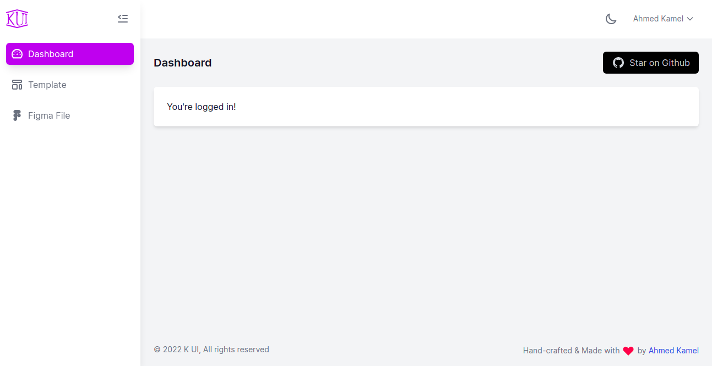
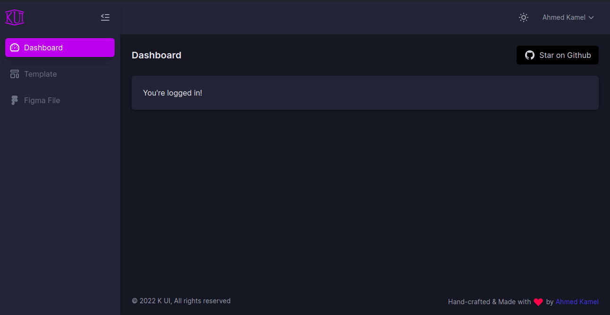
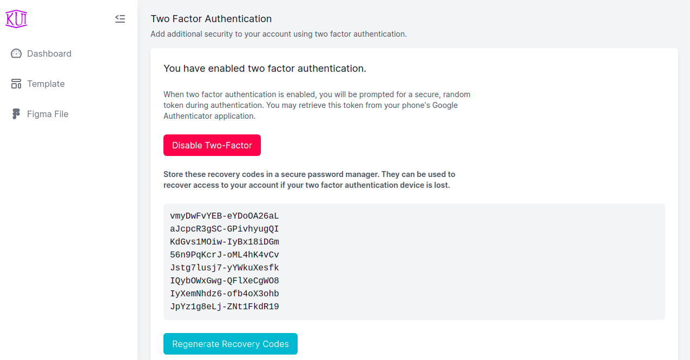
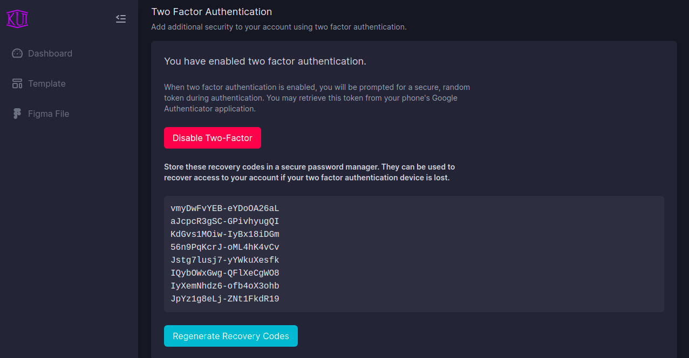
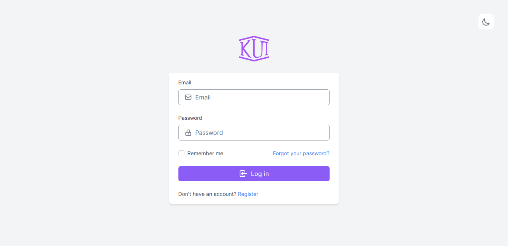
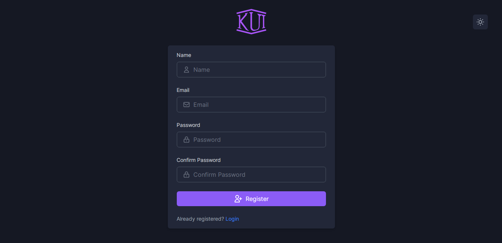

# K UI Laravel Fortify

Front-end scafolding for [laravel/fortify](https://github.com/laravel/fortify) based on [kui-dashboard](https://github.com/kamona-ui/)

[](https://github.com/Kamona-WD/kui-laravel-fortify/blob/main/LICENSE.md)

##### [Figma file](https://www.figma.com/community/file/1019844542917981418/)

##### [Laravel breeze version](https://github.com/Kamona-WD/kui-laravel-breeze/)

#### Note

> We recommend installing this package on a project that you are starting from scratch.

#### Usage

1. Fresh install Laravel >= 8.0 and `cd` to your app.

2. Install laravel/fortify

```sh
composer require laravel/fortify
```

3. Install kamona/kui-laravel-fortify

```sh
composer require kamona/kui-laravel-fortify --dev

# After finish run this command

php artisan kui-fortify:install blade # This command will publish laravel/fortify resources also.
# Available stack (blade).
# Inertia (vue,react) will be added soon.

# then
npm install && npm run dev # or yarn && yarn dev
```

4. Configure your database.
5. Run `php artisan migrate`.
6. `php artisan serve`

#### Screens

|                             |                             |
| --------------------------- | --------------------------- |
|  |  |
|  |  |
|  |  |
|  |  |
